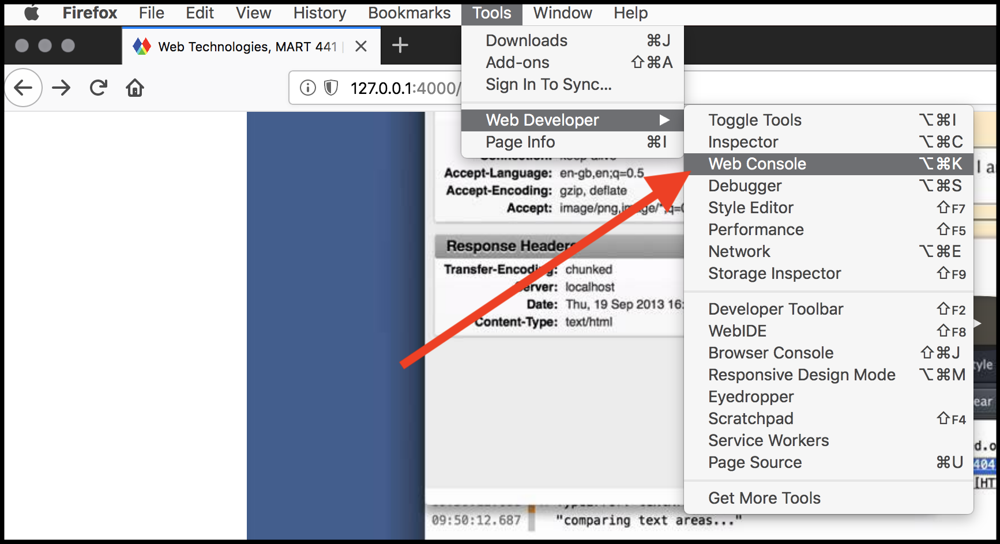

# "Hello World!" in JavaScript

As with any programming language, the first thing to do, is write and execute some sort of ["Hello World!" program](https://en.wikipedia.org/wiki/%22Hello,_World!%22_program).

The goal of the "Hello World!" program is to introduce you to the language, and prove that it works. This is essentially a way to make sure you are up and running.

> #### Browser Recommendation
>
> Before we proceed, I wanted to quickly add a note on tools and technologies. All examples for this course will be tested and demo'd with [Mozilla's Firefox browser](https://www.mozilla.org/en-US/firefox/). I would suggest you download, install, and use Firefox for this course.

## A Series of Statements

Since JavaScript is a full-fledged programming language, it behaves differently than the markup language of HTML or the styling language of CSS. The major difference is that JavaScript _executes_ a series of [_statements_](https://www.w3schools.com/js/js_statements.asp). Every "chunk" of code that does a something unique is a _statement_. JavaScript executes these statements in order, starting at the top of a file, and working its way down.

## Executing Statements in the Browser

Every modern web browser built for computers (as opposed to mobile devices/OS's) includes a ["web console"](https://developer.mozilla.org/en-US/docs/Tools/Web_Console). This console does a number of things, including;

- post errors about the site
- print out information developers tell it to
- allow for interactive JavaScript statements to be executed via the ["command line"](https://developer.mozilla.org/en-US/docs/Tools/Web_Console/The_command_line_interpreter)

<div class="embed-responsive embed-responsive-16by9"><iframe class="embed-responsive-item" src="https://www.youtube.com/embed/C6Cyrpkb25k" frameborder="0" allowfullscreen></iframe></div>

For our first "Hello World!" program, we will use the Firefox "Web Console".

To open the Web Console (<kbd>Ctrl</kbd>+<kbd>Shift</kbd>+<kbd>I</kbd> on Windows and Linux or <kbd>Cmd</kbd>-<kbd>Option</kbd>-<kbd>K</kbd> on Mac), select "Web Console" from the "Developer" menu, which is under the "Tools" menu in Firefox. By default, it will open at the bottom of the browser window. Along the bottom of the console is a command line that you can use to enter JavaScript, and the output appears in the pane above:




## Our First Program

To write and execute our first "Hello World!" program, you should type the following into the _command line_ of the _web console_, then hit `return` on your keyboard.

```js
console.log("Hello World!");
```

After pressing `return` you should see "Hello World!" printed to the _web console_ window.


**CONGRATULATIONS, YOU HAVE WRITTEN YOUR FIRST PROGRAM FOR THIS COURSE!!!!**

## What is Happening

In this "Hello World!" program, there are a couple things happening. We will discuss these in greater detail in the coming weeks.

For the moment, I will tell you that you have written a statement that uses a function (`console.log()`) that _prints directly to the JS web console_.

Within that console.log function, you included a _string_ as the sole input _parameter_.

A _string_ is any set of text, comprising letters, numbers, and special characters (i.e. `&%^`). Strings are always surrounded by matching single (`'`) or double (`"`) quotation marks.

A _parameter_ is a value, which is passed to a function for the function to _do something_ with it.


<br />

In essence, the program you wrote and executed told the JavaScript engine to print the string `"Hello World!"` to the JS web console output.

# Working with the Web Console

Many of the techniques and concepts discussed in the next few weeks will be capable of being explored through the command line of the web console. I would encourage you to use this tool as a playground for exploring JavaScript, how it works, what is possible, and trying new concepts.
